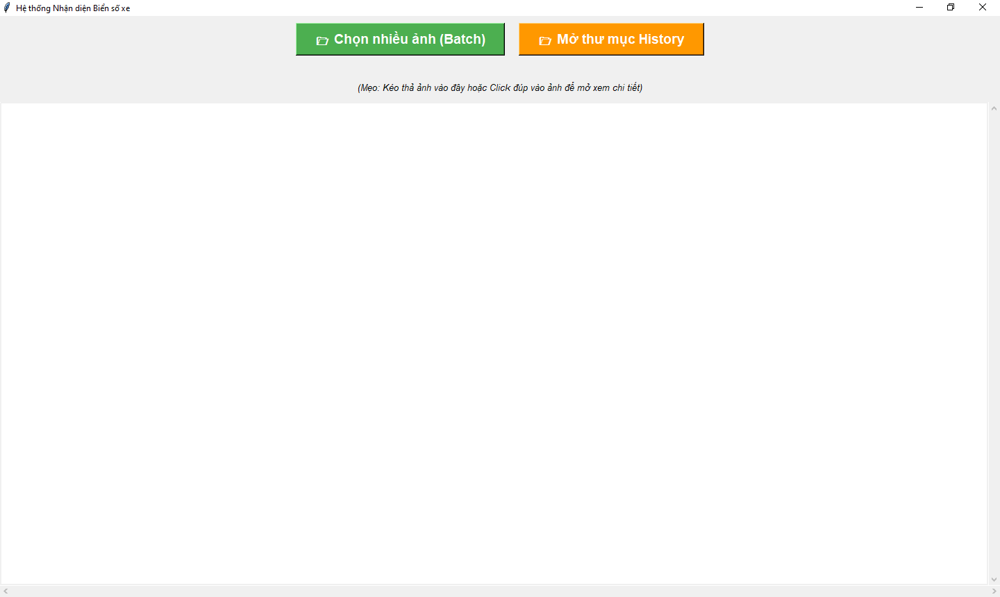

# Hệ thống Nhận diện Biển số xe (License Plate Recognition)



## 📖 Giới thiệu

Dự án này là một hệ thống nhận diện biển số xe tự động sử dụng các kỹ thuật Học sâu (Deep Learning) và Xử lý ảnh. Hệ thống kết hợp **YOLOv8** để phát hiện vị trí biển số và **EasyOCR** để đọc ký tự, cùng với các kỹ thuật tiền xử lý ảnh (Warping, Grayscale) để tối ưu hóa độ chính xác.

## 🚀 Tính năng

- **Phát hiện biển số**: Nhận diện vị trí biển số xe máy, ô tô trong ảnh.
- **Đọc biển số (OCR)**: Chuyển đổi hình ảnh biển số thành văn bản.
- **Xử lý hàng loạt**: Hỗ trợ chọn và xử lý nhiều ảnh cùng lúc.
- **Tối ưu hóa hiệu năng**: Sử dụng đa luồng (Multithreading) và cơ chế dừng sớm (Early Exit) để tăng tốc độ xử lý.
- **Lưu trữ lịch sử**: Tự động lưu ảnh gốc, ảnh cắt (ROI), ảnh tiền xử lý và kết quả vào thư mục `history`.
- **Giao diện trực quan**: Giao diện GUI thân thiện xây dựng bằng Tkinter.

## 📂 Cấu trúc Dự án

```
license-plate-recognition/
├── gui_multi.py          # File chạy chính (Giao diện người dùng)
├── clear_history.py      # Script xóa dữ liệu lịch sử
├── modules/              # Các module xử lý chính
│   ├── config.py         # Cấu hình và hằng số hệ thống
│   ├── detection.py      # Module phát hiện biển số (YOLO)
│   ├── logger.py         # Module quản lý log và lịch sử
│   ├── ocr.py            # Module đọc biển số (EasyOCR)
│   ├── preprocessing.py  # Module tiền xử lý ảnh
│   └── utils.py          # Các hàm hỗ trợ (xử lý chuỗi, format)
├── models/               # Thư mục chứa model
│   └── yolov8s.pt        # Model YOLO đã được train
├── history/              # Thư mục lưu kết quả (Tự động tạo)
├── requirements.txt      # Danh sách thư viện cần thiết
├── main.png              # Ảnh minh họa giao diện
└── README.md             # Tài liệu hướng dẫn
```

## 🛠️ Cài đặt và Hướng dẫn sử dụng

### 1. Yêu cầu hệ thống

- Python 3.10.11
- Hệ điều hành: Windows, macOS hoặc Linux.
- **Lưu ý**: Dự án được tối ưu để chạy trên **CPU**.

### 2. Cài đặt môi trường

**Bước 1: Clone dự án về máy**

```bash
git clone https://github.com/quocan9999/license-plate-recognition.git
cd license-plate-recognition
```

**Bước 2: Tạo môi trường ảo (Virtual Environment)**
Khuyến khích sử dụng môi trường ảo để tránh xung đột thư viện.

*Windows:*

```bash
py -3.10 -m venv .venv
.venv\Scripts\activate
```

*Linux/macOS:*

```bash
python3 -m venv .venv
source .venv/bin/activate
```

> **Lưu ý:** Sau khi kích hoạt thành công, bạn sẽ thấy tên môi trường ảo `(.venv)` xuất hiện ở đầu dòng lệnh trong terminal. Ví dụ: `(.venv) C:\Users\Name\Project>`

**Bước 3: Cài đặt PyTorch (Phiên bản CPU)**
Để tối ưu dung lượng và tương thích, hãy cài đặt phiên bản PyTorch dành cho CPU trước:

```bash
pip install torch torchvision torchaudio --index-url https://download.pytorch.org/whl/cpu
```
> **Lưu ý:** Nếu bạn muốn sử dụng GPU thì hãy chuyển sang phần `6. Hướng dẫn sử dụng GPU (Nâng cao)`


**Bước 4: Cài đặt các thư viện còn lại**

```bash
pip install -r requirements.txt
```

### 3. Chạy ứng dụng

Sau khi cài đặt xong, bạn có thể khởi chạy chương trình bằng lệnh:

```bash
python gui_multi.py
```

### 4. Hướng dẫn sử dụng trên giao diện

1. Nhấn nút **"📂 Chọn nhiều ảnh (Batch)"**.
2. Chọn một hoặc nhiều file ảnh (jpg, png, jpeg) từ máy tính.
3. Hệ thống sẽ tự động xử lý và hiển thị kết quả trên màn hình.
   * **Cột 1**: Ảnh gốc.
   * **Cột 2**: Ảnh kết quả với khung bao quanh biển số.
   * **Cột 3**: Biển số nhận diện được dạng text.
4. Kết quả chi tiết sẽ được lưu trong thư mục `history/`.
5. Nhấn nút **"📂 Mở thư mục History"** để truy cập nhanh vào thư mục chứa kết quả.

### 5. Xóa dữ liệu lịch sử

Để xóa toàn bộ dữ liệu trong thư mục `history` (bao gồm ảnh và file CSV), chạy lệnh:

```bash
python clear_history.py
```
*Lưu ý: Bạn sẽ được yêu cầu xác nhận (y/n) trước khi xóa.*

### 6. Hướng dẫn sử dụng GPU (Nâng cao)

Nếu máy tính của bạn có Card màn hình rời **NVIDIA**, bạn có thể kích hoạt chế độ GPU để tăng tốc độ nhận diện lên gấp 10-20 lần.

**Bước 1: Cài đặt PyTorch phiên bản hỗ trợ GPU (CUDA)**

Trước tiên, gỡ phiên bản CPU hiện tại (nếu có):
```bash
pip uninstall torch torchvision torchaudio -y
```

Sau đó, cài đặt phiên bản hỗ trợ CUDA 11.8 (Dung lượng tải về khá lớn, khoảng **2-3GB**):
```bash
pip install torch torchvision torchaudio --index-url https://download.pytorch.org/whl/cu118
```

**Bước 2: Bật cấu hình GPU**

Mở file `modules/config.py` và sửa dòng sau:
```python
OCR_GPU = True  # Đổi từ False sang True
```

*Lưu ý: Nếu máy không có GPU NVIDIA mà bật True, chương trình sẽ tự động chuyển về CPU nhưng sẽ mất thời gian khởi tạo lâu hơn.*

## 📝 Ghi chú

- File `history.csv` trong thư mục `history` chứa log chi tiết của các lần nhận diện.
- Đảm bảo file model `models/best.pt (hoặc model của bạn)` đã tồn tại trước khi chạy.
